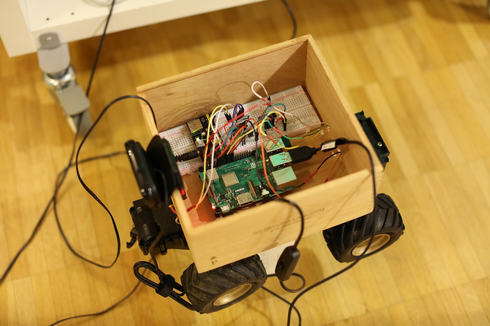

# soon to be self-driving toy car

## Structure

### modules

Contains the Car class that is the main part of the controls. It's job is to not sent too many inputs to the motor controller, e.g. if it's already going forward to instruct to go forward again. Only at key release the relevant motor (drive or steering) is stopped.

### testing folder

All code tests that are no longer used were moved to the *testing* directory. We were experimenting with getting the keyboard input be various means: sys approach, cv2.waitKey(), and pygame (of which various approaches). Pygame turned out to be the most efficient for keyboard control as multiple keys pressed simultaniously can be recognized.

Also we did tests with the webcam input and the potentiometer that is to be used for limiting the steering. For the latter, *gpiozero* was used first but replaced with more basic readout due to compability. 

## notes to myself

### connecting from computer to client using xpra

1. on Raspberry after cd to the right dir: `xpra start --start='python2 vidcap.py' --bind-tcp=0.0.0.0:10000`
2. on Computer `xpra attach tcp:<raspberryIP>:10000`

In general:

* `xpra list` to see all current sessions or get the DISPLAY number
* To end: Ctrl+c in the Terminal, don't just close the window. Else you need to `xpra stop :DISPLAY` before `xpra start ...` again

To install xrpa `sudo apt install xpra`. The version we use is 0.15.8 on the computer and 0.17.? on the Raspberry. Don't build from Source and try to get a newer version - it failed.

## links, other projects

* interesting code with socket for video transmission https://stackoverflow.com/questions/30988033/sending-live-video-frame-over-network-in-python-opencv
* AutoRCCar the red car seen on Youtube code https://github.com/hamuchiwa/AutoRCCar
* for the potentiometer readout with MCP3008 we use this: https://github.com/pediehl/raspberry-pi-mcp3008

